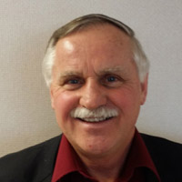
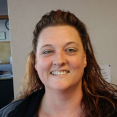
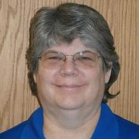

## William D. MacInnes, Ph.D.

Dr. MacInnes has been practicing clinical neuropsychology in the region for the past 30 years. He is in his 26th year of neuropsychological private practice in Michigan. Typical patient diagnoses include traumatic brain injury, concussion, dementia, stroke, aneurysm, brain tumor, multiple sclerosis, and seizure disorder. Dr. MacInnes also provides psychological evaluations for various medical procedures such as bariatric surgery, hand spinal cord pain stimulators. Dr. MacInnes has numerous professional publications in neuropsychology. He is a board-certified neuropsychologist by the American Board of Professional Neuropsychology, a Fellow in the National Academy of Neuropsychology and has 37 years of clinical experience. Dr. MacInnes’ goal is to provide the very best in neuropsychological outpatient services.

## Zigmond A Kozicki DHA, MSHA, MA, LLP

Dr. Zigmond A Kozicki is a limited license psychologist providing cognitive behavioral therapy and patient education. He specializes in pain management and bariatric post-surgical adjustment. He is also associate Professor at the University of Detroit Mercy. His prior clinical and administrative experience includes working with individuals and populations who have had mental illnesses, substance abuse and dependence, traumatic brain injury, medical rehabilitation, vocational rehabilitation, medical weight problems and chronic pain. He has been involved in employee assistance programs and has experience with occupational adjustment problems and adverse work environments. He continues to research regarding PTSD associated with motor vehicle accidents. He is involved in urban violence prevention.

## Kristen

Is our Office Manager, Biller and Receptionist for MidMichigan Neuropsychology. She can answer any general questions you may have and questions about billing, payment or scheduling. We are currently a preferred provider for BlueCross Blue Shield. We also accept Medicare and United Health Care, Humana, and Connect Care, automobile insurance and most commercial health insurance.

We are **NOT** participating providers for Blue Care Network, Health Plus, Tricare or Medicaid. Kristen will assist you to make sure we are able to provide excellent service at reasonable cost.

## Laura

Is our Senior Neuropsychological Technician with 20-years of experience.

## Teresa

Is our newest neuropsychology technician with six years of experience.