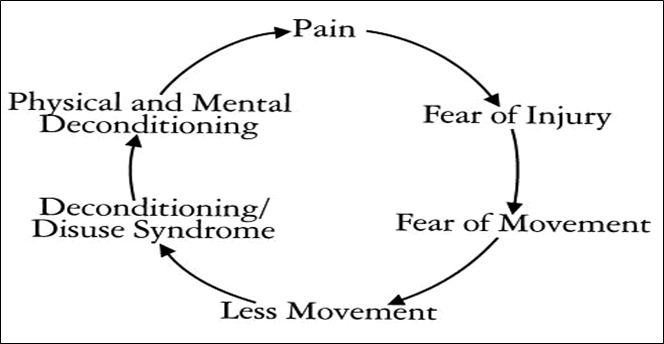

- [General](#general)
- [Brain Injury](#binjury)
- [Pain](#pain)
- [Post-Traumatic Stress](#ptsd)
- [Alzheimer's Disease](#alzheimers)

## General

### What is Neuropsychology?
Neuropsychology involves the evaluation and treatment of problems associated with brain dysfunction. This may include testing or rehabilitation to improve attention, concentration, memory, problem solving, emotional functioning or behavior. Generally, your doctor or healthcare provider requests the assistance of a neuropsychologist for diagnosis or treatment planning. A neuropsychologist works as a member of a team which may include your family physician, neurologist, neurosurgeon, physiatrist, nurse practitioner, physician assistant or others involved with your treatment.

### Why have I been referred to a neuropsychologist?
Typically, your doctor suspects something abnormal has happened to the brain and wants a detailed assessment or assistance in planning your treatment. People who have suffered strokes, head injuries, brain tumors or alcohol or drug problems are often referred to a neuropsychologist. Sometimes an individual has no identified brain disease but may have a history of learning disability or maybe experiencing attention or memory difficulties. The neuropsychologist determines what factors are important, such as attention, memory, depression, anxiety, fatigue, alcohol and/or substance abuse, and/or medication effects. Once the problem is fully understood, it is possible to plan treatment.

### What will I do when I see the neuropsychologist?
The neuropsychologist uses harmless procedures involving paper and pencil tasks and/or computer tasks. These measure attention, perception, motor skills, memory, language skills, and intellect. Sometimes basic academic skills like reading, writing, and arithmetic are examined. Other times, more complex skills such as problem-solving or abstraction are measured. Furthermore, the assessment of mood, emotion, personality, and interpersonal functioning may occur. Some procedures are simple, and some are difficult. Some may even seem silly to you, but the procedures all have a serious purpose. All that is asked is that you try your best.

### Will I be given “psychological” tests?
Often an individual’s moods and emotions are measured to get an overall picture of the total person - not just the problem areas. It is similar to taking a snapshot of both your strengths and weaknesses, some of which affect your thinking and some of which affect your feelings. These tests do not imply an emotional disorder, but they are designed to examine your emotional status.

### How long will it take?
The testing may require several hours (2-10) but breaks are given as needed. The process will not interfere with your meals or other important treatments. When longer testing is necessary, it is divided into sections so that it will not make you overly fatigued and may take place over several days.

### When will I be told the results?
The findings are sent to your health care provider usually within 2-4 weeks, who will briefly discuss them with you at your next appointment. It usually takes several days to score and interpret the results. We will also schedule an appointment with you to review the results in more detail if you desire. The results are confidential and will only be shared among the doctors, therapists or case managers who are working directly with your treatment with your written permission. If you have any questions about the procedures, please feel free to discuss these with Dr. MacInnes.

### Will my insurance pay for these tests?
Like other medical procedures, neuropsychological tests are usually covered to one degree or another by your health, auto, and/or workers comp insurance. As an outpatient, there is usually some coverage that may pay for at least a portion of these costs. For more information about your charges, insurance coverage and your payment obligations, please [contact us.](/contact)

[Back to Top](#top)

## Mild Traumatic Brain Injury or Concussion

### What is Mild Traumatic Brain Injury (MTBI)?
A person with an MTBI is one who has had a traumatically induced physiological disruption of brain function as manifested by at least one of the following:

- Any loss of memory for events immediately before or after the trauma;
- Any alteration in mental state at the time of the trauma (e.g., feeling dazed, disoriented, or confused); and
- Focal neurological impairments that may or may not be transient; but where the severity of the injury does not exceed the following:
-Loss of consciousness for approximately 30 minutes or less;
- After 30 minutes, an initial Glasgow Coma Scale (GCS) of 13 - 15;
- Post-traumatic amnesia (PTA) not greater than 24 hours
The disruption of functioning during head injury occurs when the soft, moveable brain collides with the skull because of a violent motion or blow to the head. The brain may be bruised, or nerve fibers may be damaged.

Often, someone who has sustained an MTBI may have no apparent problems, or the symptoms may go away very quickly. However, in some cases, MTBI may lead to physical, cognitive, and emotional problems.

### Symptoms
One or more of the symptoms listed below may be experienced immediately following the injury:

- Headache
- Dizziness
- Nausea
- Vomiting
- Confusion
- Slurred speech
- Tinnitus (ringing in ears)
- Fatigue
- Disorientation

Quite often, these symptoms resolve in a day or two, or more commonly, within a few weeks.  In a few instances, ongoing symptoms may persist. These may include:

- Mood swings/irritability
- Memory problems
- Impaired planning or organization
- Depression
- Slowed information processing
- Decreased emotional control
- Sensitivity to light, noise, crowds, busy environments
- Language/speech problems
- Decreased learning ability
- Physical and mental fatigue
- Vision, smell, and taste changes
- Increased fears, anxieties
- Alcohol intolerance or changed tolerance to medications
- Motion sickness
- Sleep and sexual problems
- Headaches

It may be difficult to describe or define the symptoms. A person with an MTBI may simply feel that “something is different”. While many of their skills are still intact, they may feel that they are just not the same person they were before the injury occurred.

Some people find it difficult to work, function at home, and also to relax. The suggested way to handle this is to rest and gradually resume daily activities. To ignore the symptoms and try to get back to a normal routine can make the symptoms worse and extend the length of time for recovery. Most people will recover completely in 3-6 months. However, if the symptoms worsen or do not disappear, help should be sought. Early evaluation and treatment are vital to attaining the best possible recovery.

### Early Evaluation
It is common to be treated in an emergency room for a mild blow to the head, and then immediately discharged. Damage from a mild traumatic brain injury (MTBI) may not show up on an x-ray, CT scan, or Magnetic Resonance Imaging (MRI), so one should consult their physician if they have suffered any head injury.

If symptoms persist or there are concerns about a possible MTBI, one may want to consult a specialist. Often, a physiatrist (rehabilitation physician) will conduct a physical exam to further define any problems the person may be experiencing. The physiatrist would then determine what other specialists need to be involved in the patient‘s care.

[Back to Top](#top)

## Chronic Pain Management

### Chronic Pain
It is defined as pain which occurs on most days and lasts from three months to many years.

### Types of Chronic Pain
Nociceptive pain occurs when there is clear damage to tissue. Nociceptive simply means ‘causing pain’.

Neuropathic pain is the other type of chronic pain and results from damage to the nerves, spinal cord or the brain.

In reality, many pain conditions can involve a combination of nociceptive and neuropathic pain.

### Effects of Chronic Pain
It is an unpleasant sense of discomfort.

Chronic pain may cause other symptoms or conditions, including depression and anxiety. It may also contribute to decreased physical activity given the apprehension of exacerbating pain.

### Pain Behaviors**
Are defined as things people do when they suffer or are in pain. Pain behaviors may include:

- Talking or complaining about the pain
- Grimacing, moaning, crying, limping, moving slowly
- Taking pain medicine, rubbing a painful area
- Moving more slowly, asking for help, lying down
- Avoidance of certain activities, seeking further treatment

### Managing Chronic Pain
Chronic Pain is usually best managed with the combination of medication and nonmedication techniques such as group and individual psychotherapy, biofeedback, progressive muscle relaxation, and visualization.

The focus of Pain Management includes the following goals:

- Re-conceptualization of chronic pain
- Improve the subjective pain experience
- Reduce unhelpful beliefs and behaviors
- Increase application of coping responses
- Relapse management
- Increase activity & work status
- Improve self-worth by increasing self-care.
- Cognitive therapists work with the person to challenge thinking errors. By pointing out alternative ways of viewing a situation, the person’s view of life, and ultimately their mood will improve.

### Cognitive Behavior Therapy (CBT)
Is based on the understanding that much of how we feel is determined by what we think. Common cognitive errors for chronic pain sufferers include:

- **Personalization** — relating negative events to oneself when there is no basis.
- **Dichotomous Thinking** — seeing things as black and white, all or none.
- **Magnification/Minimization** - distorting the importance of particular events or body symptoms.

### What is involved in CBT?
CBT is undertaken when people decide they are ready for it and with their permission and cooperation.

The therapy is directed at the person's specific anxieties and will be tailored to his or her needs

There are no side effects other than the discomfort of temporarily increased anxiety.

It may be conducted individually or with a group of people who have similar problems.

### Typical Topics for CBT
- The personal orientation to chronic pain.
- Identifying and reducing stress.
- Identifying psychological defense mechanisms.
- The usefulness of relaxation, exercise, drugs, and attention focus on managing stress and pain.
- Changing the recurring complaint and emotional state.
- Pain, anxiety, and depression.
- Activity pacing and self-management.
- Healthy alternatives & social distractions.
- Developing a future view of self and adjusting to a changed life.

[Back to Top](#top)

## Post-Traumatic Stress Disorder
Post-Traumatic Stress Disorder (PTSD) results from exposure to an overwhelming stressful event or series of events, such as an automobile accident, workplace injury, natural disaster, war, physical or sexual assault. It is a normal reaction to an abnormal situation. Most survivors of trauma experience some degree of stress reactions (such as nightmares, flashbacks, difficulty sleeping, feeling detached) yet return to normal given a little time. However, for some these reactions do not go away on their own, or may even get worse over time. These individuals may develop PTSD.

### What is Post Traumatic Stress Disorder (PTSD)?
Post-Traumatic Stress Disorder is an anxiety disorder that can occur after experiencing or witnessing a traumatic event.

People with PTSD develop three different kinds of symptoms:

- Re-experiencing the trauma in some way
- Avoiding places or people that remind them of the trauma, and isolating from others
- Numbing feelings or experiencing a constant aroused state.
- We also know that there are biological changes that are associated with PTSD. People with PTSD often may develop depression, substance abuse, problems with memory and cognition, and physical and mental health problems. These problems may lead to impairment in the person’s ability to function in social or family life. PTSD can contribute to occupational instability, marital and family problems.

### What are the symptoms of PTSD?
People with PTSD describe themselves with words such as shattered, broken, wounded, ripped or torn apart and report they will never get their life back together. The event has divided their life into two distinct times: before and after the trauma. Loss of happiness, diminished positive life outlook and resentment are common features of this disorder. Also, they have the following four symptoms:

**Re-experiencing the event**
People with PTSD relive the traumatic event. They may have upsetting memories that can come back when they are not expecting them. They may be triggered by a reminder such as when a combat veteran hears a car backfire, a motor vehicle accident victim drives by a car accident or a rape victim sees a news report of a recent sexual assault. These memories can cause both emotional and physical reactions, sometimes feeling so real it is as if the event is happening again. This is called a "flashback." Reliving the event may cause intense feelings of fear, helplessness, and horror similar to the feelings they had when the event first took place.

**Avoidance**
People make an extra effort to prevent the recurrence of the traumatic event by avoiding situations that trigger memories, such as places where the trauma occurred or seeing TV programs or news reports about similar events. They may avoid other sights, sounds, smells or people that are reminders. Some people try to distract themselves with busy activities to avoid thinking about the traumatic event.

**Numbing**
People with PTSD may find it difficult to be in touch with or express their feelings. They may feel emotionally "numb" and may isolate themselves from others. They may be less interested in activities they once enjoyed. Some people forget or are unable to talk about, important parts of the event. Some people think that they will have less opportunity or a shortened life span and can no longer reach personal goals. They may neglect their work or family responsibilities, while others self-medicate with alcohol and drugs and become addicted to the substance in the process.

**Arousal**
People with PTSD may feel constantly alert after the traumatic event. This is known as increased emotional arousal and it can cause difficulty sleeping, outbursts of anger or irritability and difficulty concentrating. They may find that they are constantly ‘on guard’ for signs of danger and they may also startle easily.

### How does PTSD develop?
Although symptoms can begin right after a traumatic event, PTSD is not diagnosed unless the symptoms last for at least one month, and either causes significant distress or interfere with work or home life. To be diagnosed with PTSD, a person must have three different types of symptoms: re-experiencing symptoms, avoidance and numbing symptoms and arousal symptoms.

About 60% of men and 50% of women experience a traumatic event in their lifetime and most who are exposed to a traumatic event will have some of the symptoms of PTSD in the days and weeks to follow. For some, these symptoms are more severe and long-lasting. The reasons why some people develop PTSD are still being studied. There are biological, psychological and social factors that affect its development.

### What other problems do people with PTSD experience?
It is very common for other conditions to occur along with PTSD. More than half of men with PTSD also have problems with alcohol. The next most common is depression followed by behavioral problems and then drug abuse. In women, depression is the most common followed by anxiety and then alcohol or prescription medication abuse.

People with PTSD often have problems functioning. In general, they experience more unemployment, divorce or separation, spouse abuse, and job loss. They may experience a wide variety of physical and emotional symptoms.

### Managing Post Traumatic Stress Disorder (PTSD)
PTSD can be managed through self-directed techniques that can be learned in psychotherapy. The symptoms can be improved with medicines such as antidepressants. People in treatment often reveal concealed wounds, resolve guilt and reduce the effect of the traumatic incident. Treatment enables the person to transition back into a meaningful life.

[Back to Top](#top)

## Alzheimer’s Disease

### What is Alzheimer’s Disease?
Alzheimer’s Disease is a neurological illness involving deterioration in mental functions resulting from changes in brain tissue which includes shrinking of brain tissues.

Alzheimer’s Disease is progressive, irreversible, and at this time, there is no known cause or cure.

Senile dementia/Alzheimer’s type is the most common cause of intellectual decline with aging. Though Alzheimer’s Disease can be found in people in their 40’s and 50’s, it is generally diagnosed in individuals 60 years of age and older. There is an increasing incidence of Alzheimer’s with each decade past 60. Alzheimer’s Disease is found in both sexes and people of all races and social, economic, and environmental backgrounds.

### Symptoms
Common symptoms may include:

**Recent Memory Loss that Affects Job Skills:**
May forget things more often, and not remember them later.

**Difficulty Performing Familiar Tasks:**
A person prepares a meal and not only forgets to serve it, but also forget they made it.  They may burn more meals, because the person is easily distracted.

**Problems With Language:**
May forget simple words or substitute inappropriate words.

**Disorientation of Time and Place:**
Become lost on their street, not knowing where they are, how they got there, or how to get back home.

**Poor or Decreased Judgment:**
Could entirely forget the child under their care and may dress inappropriately.

**Problems With Abstract Thinking:**
May completely forget what numbers are and what needs to be done with them.

**Misplacing Things:**
May put things in inappropriate places; for example, iron in the stove.

**Changes in Mood or Behavior:**
Could exhibit rapid mood swings; for example, from calm to tears to anger, for no apparent reason.

**Changes in Personality:**
Personalities could change drastically, becoming confused, suspicious, or fearful.

**Loss of Initiative:**
May become passive and require cues and prompting to become involved.

### How is a Diagnosis Made?
It is important to see a physician when any symptoms are recognized. Alzheimer’s Disease is diagnosed by the health care provider based in part on the history and progression of symptoms. Each person suspected of having Alzheimer’s Disease should undergo a thorough physical and neuropsychological evaluation.

The physical evaluation will discover reversible physical conditions that mimic Alzheimer’s Disease by undergoing comprehensive medical assessment and laboratory tests.

The neuropsychological examination will isolate perceptual and cognitive domains and evaluate each one with standardized norms. This includes basic perceptual-motor abilities, memory, attention, and concentration, language, problem-solving, mental flexibility, and orientation. An assessment of mood and personality is frequently included. This aids in the formulation of a diagnosis.

### Treatment
There is no known cure for Alzheimer’s Disease, and treatment is limited to the relief of symptoms and protection from the effects of the deteriorating condition. Some new medications may slow the progress of the disorder. Anxiety and agitation can be minimized through proper handling by the caretaker but may require the use of drugs and tranquilizers. General nutrition, guided exercise, and mentally stimulating activities can be done to help an Alzheimer’s patient function at the best of his or her capabilities. Family counseling may help in coping with the changes required for home care. Eventually, 24-hour monitoring and assistance may be required to provide a safe environment, control aggressive or agitated behavior, and meet physiologic needs. This may include in-home care, boarding homes, adult daycare, or convalescent homes.

### Where Can the Family Get Help?
Caring for an Alzheimer’s patient can be an extremely difficult task and can produce an enormous strain on a family’s physical, emotional, and financial resources. Several local area support groups are part of the Mid-Michigan chapter. These support groups are free educational and supportive meetings to provide a forum for family and friends to discuss mutual problems, experiences, and ideas.

[Back to Top](#top)
